<table border="0" cellspacing="0" cellpadding="10">
<tr>
<td></td>
<td>

# Spotify Data Pipeline (Azure)

</td>
</tr>
</table>


> A production-grade, end-to-end data engineering pipeline built on Azure and Databricks that ingests Spotify data from Azure SQL via Azure Data Factory using metadata-driven, Incremental CDC (Change Data Capture) loading, processes it through a full Medallion Architecture (Bronze → Silver → Gold) with AutoLoader and Spark Structured Streaming, and delivers SCD-managed dimension and fact tables via Databricks Delta Live Tables - all governed through Unity Catalog with Unity Metastore.

---

## Table of Contents

- [Introduction](#introduction)
- [Architecture](#architecture)
- [Source Setup - SQL Scripts](#source-setup---sql-scripts)
- [Azure Configuration](#azure-configuration)
- [Pipeline Deep Dive](#pipeline-deep-dive)
  - [1. Bronze - Incremental Ingestion via ADF](#1-bronze---incremental-ingestion-via-adf)
  - [2. Silver - AutoLoader & Spark Structured Streaming](#2-silver---autoloader--spark-structured-streaming)
  - [3. Gold - Delta Live Tables & SCD](#3-gold---delta-live-tables--scd)
- [Databricks Asset Bundle](#databricks-asset-bundle)
- [Experiments & Extras](#experiments--extras)
- [Key Engineering Decisions](#key-engineering-decisions)

---

## Introduction

This project builds a real-world lakehouse pipeline for Spotify streaming analytics. Source data lives in **Azure SQL** across five tables - `DimUser`, `DimTrack`, `DimArtist`, `DimDate`, and `FactStream`. Data flows through three lake layers managed in **Azure Data Lake Storage Gen2** and is processed using a combination of **Azure Data Factory**, **Databricks AutoLoader**, and **Delta Live Tables**.

The pipeline handles:
- **Incremental CDC (Change Data Capture) loading** from Azure SQL into the Bronze layer, tracking the latest watermark per table in a JSON file
- **Stream processing** in the Silver layer using AutoLoader and Spark Structured Streaming with `.trigger(once=True)`
- **Slowly Changing Dimensions** (SCD Type 1 & 2) and data quality expectations in the Gold layer via Databricks DLT
- **Full governance** via Unity Catalog and Unity Metastore - all tables registered under `spotify_cata`

---

## Architecture

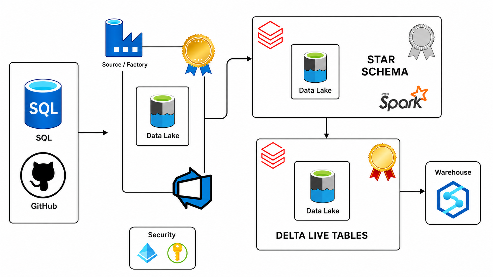

Data originates from **Azure SQL** and **GitHub** (for code/IaC). **Azure Data Factory** ingests raw data into the Bronze layer of **ADLS Gen2**. From there, **Apache Spark** on Databricks shapes the data into a Star Schema in the Silver layer. Finally, **Delta Live Tables** processes the Silver data into the Gold layer and surfaces it in a serving warehouse - with **Azure Key Vault** and **Unity Catalog** handling all security and governance throughout.

---

## Source Setup - SQL Scripts

Before the pipeline runs, the Azure SQL database must be seeded and prepared. This is handled by two scripts in `sql_scripts/`, and a critical one-time step that bridges them.

### Step 1 - `spotify_initial_load.sql`

This script sets up the entire source schema from scratch. It drops any existing tables, recreates all five with proper DDL, and seeds them with the full initial dataset:

```sql
CREATE TABLE DimUser   (user_id INT PRIMARY KEY, user_name VARCHAR(255), ..., updated_at DATETIME);
CREATE TABLE DimTrack  (track_id INT PRIMARY KEY, track_name VARCHAR(255), ..., updated_at DATETIME);
CREATE TABLE DimArtist (artist_id INT PRIMARY KEY, artist_name VARCHAR(255), ..., updated_at DATETIME);
CREATE TABLE DimDate   (date_key INT PRIMARY KEY, date DATE, ..., weekday VARCHAR(20));
CREATE TABLE FactStream(stream_id BIGINT PRIMARY KEY, ..., stream_timestamp DATETIME);
```

After the DDL, hundreds of `INSERT` statements populate each table - for example 500 users, 500 tracks, 500 artists, 365 date entries, and 1,000 fact stream rows. Every row is given an `updated_at` (or `stream_timestamp`) timestamp ending in `19:49:55` - this becomes the baseline CDC watermark that ADF will read on its first run.

### Step 2 - Drop PK Constraints Before Incremental Load

This is the step shown in the screenshot and it is critical to understand **why** it is needed.

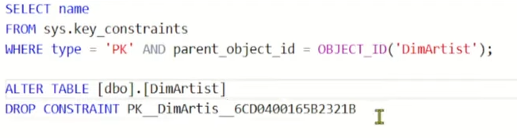

The initial load creates all tables with `PRIMARY KEY` constraints. However, `spotify_incremental_load.sql` (Step 3 below) simulates source system changes by **re-inserting updated versions of existing records** - for example, `track_id = 5` appears in both scripts but with a newer `updated_at` timestamp of `19:49:56`. SQL Server will **reject any INSERT that violates a PK constraint**, meaning the incremental script would fail on every record that already exists in the table.

The solution is to first **discover the auto-generated constraint name** using `sys.key_constraints`, then drop it:

```sql
-- Step 1: Find the auto-generated PK constraint name
SELECT name
FROM sys.key_constraints
WHERE type = 'PK' AND parent_object_id = OBJECT_ID('DimArtist');

-- Step 2: Drop it (repeat for each table)
ALTER TABLE [dbo].[DimArtist]
DROP CONSTRAINT PK__DimArtis__6CD0400165B2321B;
```

This must be run for all five tables before Step 3. Without it, `spotify_incremental_load.sql` will fail on any record whose primary key already exists in the table - blocking the entire CDC simulation.

### Step 3 - `spotify_incremental_load.sql`

With PK constraints dropped, this script inserts a fresh batch of records across all five tables. The key difference from the initial load is that `updated_at` timestamps now end in `19:49:56` - one second later than the baseline. Some records are net-new (new `track_id` values), while others are updates to existing records (same `track_id`, different column values and a newer timestamp).

```sql
-- Example: track_id 5 updated - same key, new album and newer updated_at
INSERT INTO DimTrack (...) VALUES (5, 'Extended bottom-line conglomeration', 4, 'Increase Album', 138, '2023-01-01', '2025-10-07 19:49:56');
```

When ADF runs its incremental pipeline, it compares each row's `cdc_col` against the last watermark stored in `cdc.json`. Since `19:49:56 > 19:49:55`, these rows are picked up as new/changed data and ingested into Bronze - exactly mimicking how a real source system's CDC stream would behave.

---

## Azure Configuration

### Identity & Access (IAM)

The ADF instance (`df-prasunspotifyproject`) is deployed in **Germany West Central** with a **System-Assigned Managed Identity**. This identity is granted Storage Blob Data Contributor on the ADLS Gen2 account - no credentials stored in pipelines, no service principal secrets to rotate.

### Linked Services

Two linked services connect ADF to the rest of the stack:

**`datalake`** - connects to `spotifyprasunproject.dfs.core.windows.net` via the managed identity. All Bronze reads and writes go through this service.

**`azure_sql`** - connects to `spotifyprojectserverprasun.database.windows.net` using SQL authentication with encrypted credentials stored inside ADF's credential store (never in source control).

### Datasets

Two parameterised datasets handle all data movement dynamically - no table-specific datasets needed:

| Dataset | Format | Parameters |
|---|---|---|
| `parquet_dynamic` | Parquet (Snappy) | `container`, `folder`, `file` |
| `json_dynamic` | JSON | `container`, `folder`, `file` |

A **single dataset definition** serves all five tables. Paths are constructed at runtime using ADF expressions like `@concat(item().table,'_',variables('current'))`.

---

## Pipeline Deep Dive

### 1. Bronze - Incremental Ingestion via ADF

#### Metadata-Driven Incremental Loading

Rather than hardcoding one pipeline per table, a single parameterised pipeline (`incremental_ingestion`) accepts `schema`, `table`, `cdc_col`, and `from_date` as inputs. The `incremental_loop` pipeline wraps this in a **ForEach loop** over a JSON array of all five tables - one pipeline definition, five tables processed. On failure, an **Alerts** `WebActivity` fires immediately:

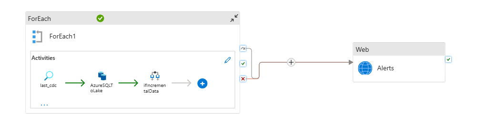

```json
"loop_input": [
  { "schema": "dbo", "table": "DimUser",    "cdc_col": "updated_at"       },
  { "schema": "dbo", "table": "DimTrack",   "cdc_col": "updated_at"       },
  { "schema": "dbo", "table": "DimDate",    "cdc_col": "date"             },
  { "schema": "dbo", "table": "DimArtist",  "cdc_col": "updated_at"       },
  { "schema": "dbo", "table": "FactStream", "cdc_col": "stream_timestamp" }
]
```

#### CDC Watermark Strategy

Each table has a companion `cdc.json` file in the Bronze layer (e.g. `bronze/DimUser_cdc/cdc.json`) that stores the last-loaded timestamp. On every run:

1. **Lookup** reads the last watermark from `cdc.json`
2. **SetVariable** captures `utcNow()` as the current timestamp for the output filename
3. **Copy** pulls only rows where `cdc_col > last_watermark` from Azure SQL
4. **IfCondition** checks `dataRead > 0`:
   - **No new data** → Delete the empty Parquet file (no lake clutter)
   - **New data found** → Run a `Script` activity to compute `MAX(cdc_col)` from SQL, then overwrite `cdc.json` with the new watermark

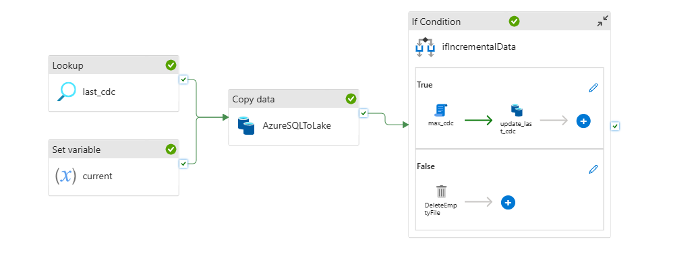

**False branch - no new data found, empty file cleaned up:**

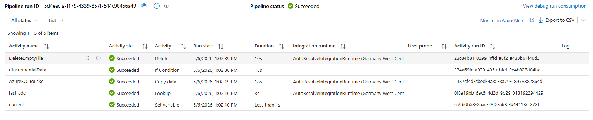

**True branch - new data found, CDC watermark updated:**

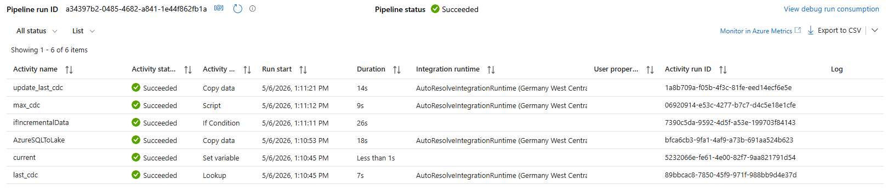

#### Backfilling

The `from_date` parameter overrides the `cdc.json` lookup entirely when provided, enabling a full reload of any table from any historical point without modifying pipeline logic:

```python
"@{if(empty(pipeline().parameters.from_date), activity('last_cdc').output.value[0].cdc, pipeline().parameters.from_date)}"
```

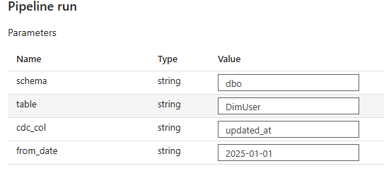

#### Alerting with Logic Apps

An **Azure Logic App** is wired to the `ForEach` activity's failure/skip condition via a `WebActivity` POST. On any ingestion failure, an HTTP trigger fires the Logic App which sends a Gmail alert containing `pipeline_name` and `pipeline_runId`:

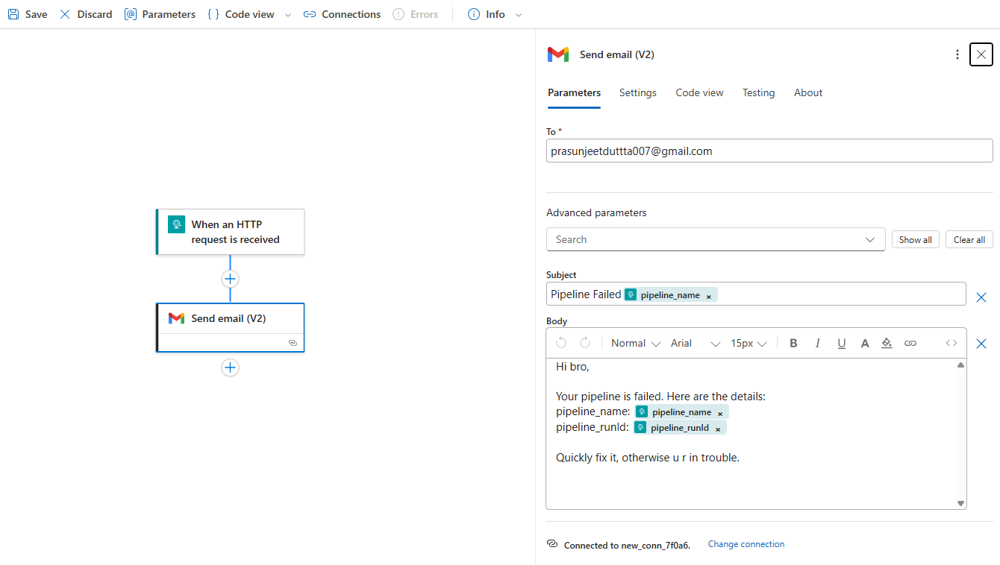

---

### 2. Silver - AutoLoader & Spark Structured Streaming

Each dimension and fact table is processed using Databricks **AutoLoader** (`cloudFiles` format). AutoLoader monitors the Bronze ADLS container for new Parquet files and processes only new arrivals - avoiding full re-scans on each run. The stream is written to Unity Catalog Delta tables with `.trigger(once=True)`, behaving like a batch job while retaining all incremental-processing guarantees of Structured Streaming. Checkpoints prevent reprocessing already-ingested files.

```python
df_user = spark.readStream.format("cloudFiles") \
    .option("cloudFiles.format", "parquet") \
    .option("cloudFiles.schemaLocation", "abfss://silver@.../DimUser/checkpoint") \
    .load("abfss://bronze@.../DimUser")

df_user.writeStream.format("delta") \
    .option("checkpointLocation", "abfss://silver@.../DimUser/checkpoint") \
    .trigger(once=True) \
    .toTable("spotify_cata.silver.DimUser")
```

#### Transformations Applied in Silver

- **DimUser** - `upper()` on `user_name`; deduplication on `user_id`; drop `_rescued_data`
- **DimTrack** - `durationFlag` bucket column (`low`/`medium`/`high` by `duration_sec`); `regexp_replace` to clean hyphens in track names; drop `_rescued_data`
- **DimArtist / DimDate / FactStream** - drop `_rescued_data` 

A shared `reusable` utility class (`utils/transformations.py`) centralises the `dropColumns` pattern across all notebooks, keeping transformation logic DRY.

---

### 3. Gold - Delta Live Tables & SCD

The Gold layer is implemented as a **Databricks Delta Live Tables** pipeline. Each table follows a two-step pattern - a streaming staging table reads from Silver, and `create_auto_cdc_flow` applies CDC into a final streaming table with full SCD management:

| Table | SCD Type | Key | Sequence By |
|---|---|---|---|
| `DimUser` | Type 2 | `user_id` | `updated_at` |
| `DimTrack` | Type 2 | `track_id` | `updated_at` |
| `DimDate` | Type 2 | `date_key` | `date` |
| `FactStream` | Type 1 | `stream_id` | `stream_timestamp` |

```python
dlt.create_auto_cdc_flow(
  target     = "dimtrack",
  source     = "dimtrack_stg",
  keys       = ["track_id"],
  sequence_by = "updated_at",
  stored_as_scd_type = 2
)
```

**DLT pipeline graph - all streaming tables healthy:**

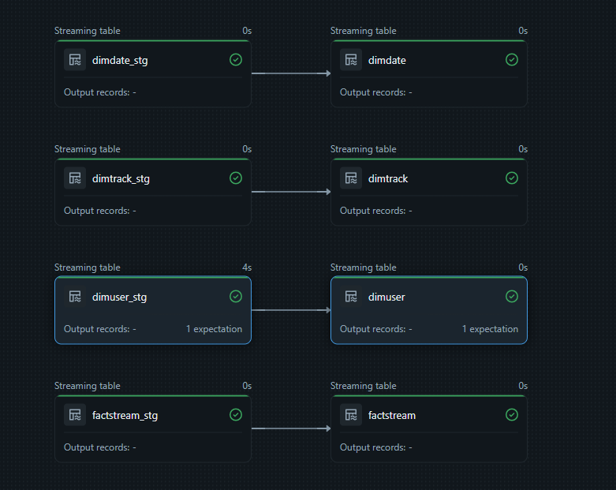

**DLT pipeline run - records upserted across all tables (dimdate: 365, dimtrack: 502, dimuser: 500, factstream: 1K):**

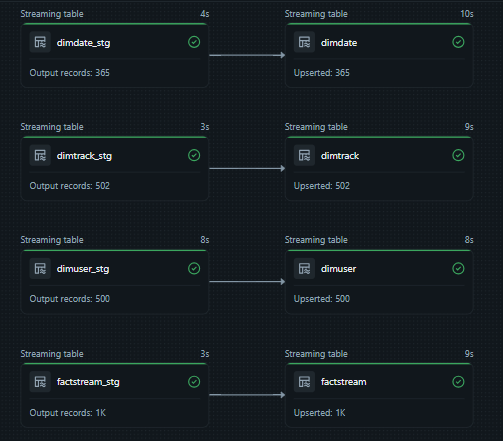

#### SCD Type 2 History Verification

SCD Type 2 on dimensions maintains full history - closed records get `__END_AT` populated. Querying `WHERE __END_AT IS NOT NULL` confirms historical versions are being tracked - these are the records updated by `spotify_incremental_load.sql` whose old versions were closed off by the DLT CDC flow:

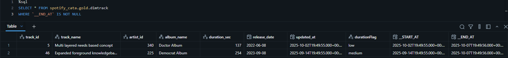

Querying both the current and historical versions of the same `track_id` (e.g. track_id 5, which was updated in the incremental load) shows the full version lineage side by side - superseded version has `__END_AT` set, current version shows `null`:

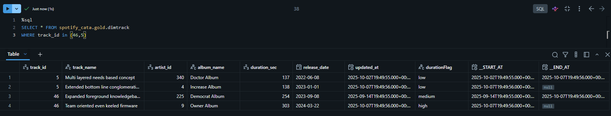

#### Data Quality Expectations

`DimUser` uses `@dlt.expect_all_or_drop` to enforce data quality - rows violating the constraint are silently dropped rather than failing the pipeline. Applied at both staging and final table level, visible in the DLT graph as "1 expectation":

```python
expectations = { "rule_1": "user_id IS NOT NULL" }

@dlt.expect_all_or_drop(expectations)
def dimuser_stg(): ...

dlt.create_streaming_table(name="dimuser", expect_all_or_drop=expectations)
```

---

## Databricks Asset Bundle

The entire Databricks infrastructure is managed as a **Databricks Asset Bundle (DAB)**, version-controlled in GitHub alongside the pipeline code. The bundle defines two targets:

| Target | Mode | Catalog | Schema |
|---|---|---|---|
| `dev` | development (prefixed, schedules paused) | `databricksspotifyproject` | `dev` |
| `prod` | production | `databricksspotifyproject` | `prod` |

The DLT pipeline runs **serverless**, with all dependencies injected via an editable install of the `spotify_dab` package. A daily `sample_job` orchestrates the full refresh - notebook task → Python wheel task → DLT pipeline task - all parameterised with `${var.catalog}` and `${var.schema}` so dev and prod stay structurally identical.

Unity Catalog and Unity Metastore govern all assets: every table written in Silver and Gold is registered under `spotify_cata`, making them discoverable, lineage-tracked, and access-controlled from Databricks Data Explorer.

---

## Experiments & Extras

### Jinja Templating in Databricks

A Jinja-templated query builder (`Jinja/jinja_notebook.py`) was prototyped to dynamically generate multi-table JOIN SQL from a Python config list - without hardcoding table names or column lists:

```python
parameters = [
    { "table": "spotify_cata.silver.factstream", "alias": "factstream", "cols": "..." },
    { "table": "spotify_cata.silver.dimuser",    "alias": "dimuser",    "cols": "...", "condition": "..." },
    { "table": "spotify_cata.silver.dimtrack",   "alias": "dimtrack",   "cols": "...", "condition": "..." }
]
```

The Jinja template places the first entry in `FROM` and all subsequent ones as `LEFT JOIN ... ON ...`. Adding a new dimension requires only one new dict in the list - the SQL generates itself. This is especially powerful for metadata-driven reporting layers where the join graph lives in a config table rather than hardcoded in notebooks.

---

## Key Engineering Decisions

| Decision | Rationale |
|---|---|
| Two-script SQL setup | `initial_load` seeds baseline data; `incremental_load` simulates source changes with newer timestamps - together they reproduce a real CDC scenario in a controlled test environment |
| Drop PK before incremental load | SQL Server rejects `INSERT` on duplicate PKs; dropping constraints allows updated versions of existing records to be inserted with newer `updated_at` values, correctly simulating a CDC event |
| Managed Identity over service principal | No secret rotation, no credentials in code - IAM-native access to ADLS |
| CDC via watermark JSON | Lightweight, serverless alternative to SQL Change Tracking - no source DB schema changes needed |
| Metadata-driven ForEach loop | One pipeline definition handles all five tables; adding a new table is a config change, not a code change |
| `from_date` override parameter | Enables full backfill of any table from any historical point without modifying pipeline logic |
| Delete empty file on False branch | Keeps the Bronze layer clean - no zero-byte Parquet files accumulating on idle runs |
| AutoLoader over manual file listing | Schema evolution support, exactly-once file processing guarantees, built-in checkpointing |
| `.trigger(once=True)` in Silver | Processes all pending files in one batch run while retaining Structured Streaming incremental semantics |
| DLT `create_auto_cdc_flow` | Declarative SCD management - no MERGE statements written by hand; DLT handles out-of-order events via `sequence_by` |
| `expect_all_or_drop` on DimUser | Bad rows are quarantined, not pipeline-halting - Gold layer stays clean without failing the whole refresh |
| Logic App for alerting | Event-driven, no polling - fires only on pipeline failure via ADF's WebActivity POST |
| Databricks Asset Bundle for IaC | Dev/prod parity enforced through config variables - the same YAML deploys to both environments |

---

<p align="center">
  Built by Prasun Dutta · Assisted by <a href="https://code.claude.com/docs/en/overview">Claude Code</a>
</p>

---
<p align="center">
  <sub>Animated icons by <a href="https://www.flaticon.com/free-animated-icons/headphones" title="headphones animated icons">Headphones animated icons created by Freepik - Flaticon</a></sub>
</p>
